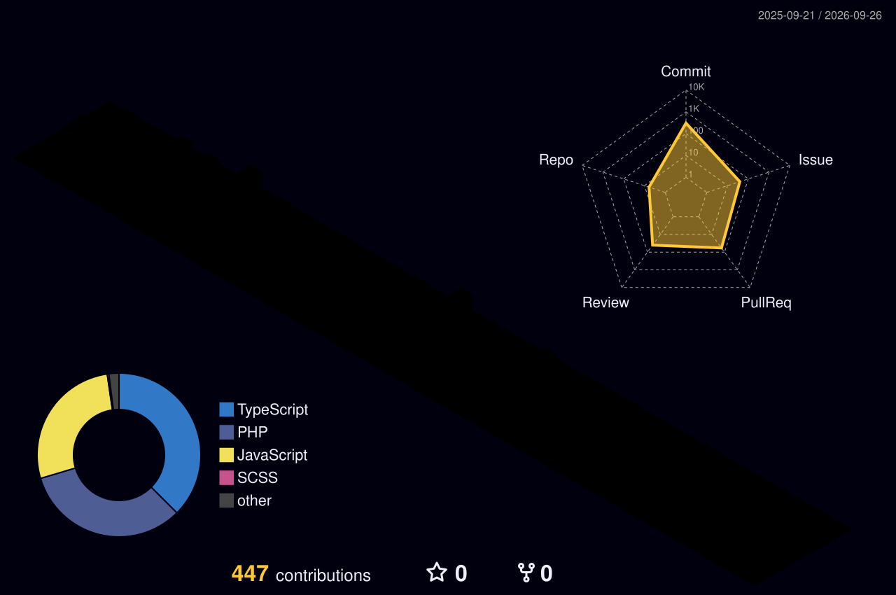

# Hello Everyone! 👋

I'm **Alfredo Carrero**, 29 years old, and I live in **Almodóvar del Campo** (Ciudad Real), Spain.  
Currently, I am a **Web Application Development** student 👨‍💻 at **CIFP Virgen de Gracia** (Puertollano).

## 🤓 About Me

I am passionate about **technology 💻** and **sports ⚽**, always eager to learn more about development and programming.  
I also consider myself a bit **restless**, enjoying **learning a variety of things on my own** 📚, like creating _web applications, music, and more_ 🔍.

---

## 📬 Contact Me

- **Email**: [alfredoibros@gmail.com](mailto:alfredoibros@gmail.com)
- **LinkedIn**: [Alfredo Carrero Muñiz](https://www.linkedin.com/in/alfredo-carrero-mu%C3%B1iz-006963199/)

---

## 🛠️ Technologies & Tools

### 💻 Programming Languages

  

### 🎨 Frontend Development

  

### ⚙️ Backend Development

  

### 🗄️ Databases

  

### 🛠️ Tools & Environments

  

## 📊 My GitHub Stats

  

